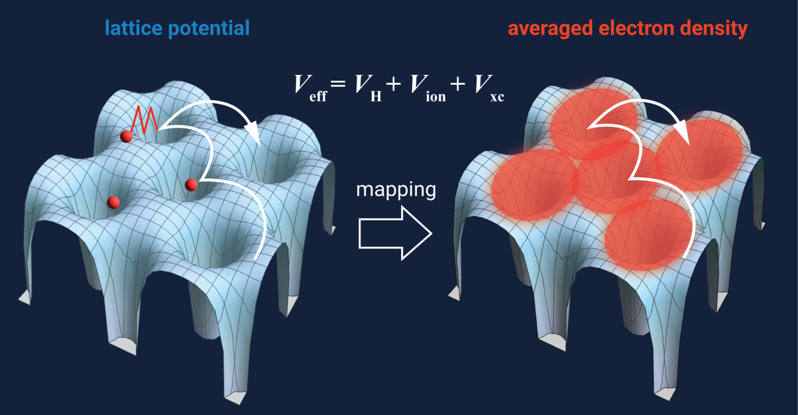

# Welcome

## Workshop 2025: Exploring Atomic Scale Physics with Ab-initio Calculations

This workshop introduces participants to ab-initio (first-principles) methods for studying atomic-scale physics. We'll begin with foundational concepts in electronic structure and Density Functional Theory (DFT), and then apply them using **Quantum ESPRESSO (QE)**. The course continues with advanced beyond-DFT topics like **DFT+U** and an introduction to **Many-Body Perturbation Theory (MBPT)** through Green's function-based methods.

Designed for **beginners**, the workshop also accommodates those with partial familiarity looking to deepen their understanding. Both **lecture** session and **hands-on** sessions are included.

We use **Quantum ESPRESSO** due to its open-source nature, flexibility, and user-friendliness. Installation and setup support for QE and related tools like `WEST`, `VESTA`, `XCrySDen`, and `c2x` will be provided.

> ⚠️ This workshop will be conducted primarily in **Bangla**, but all materials (slides, notes) will be in **English or bilingual** for clarity. The schedule is flexible to accommodate participant availability.

---

## 👤 Who Should Join

- Undergraduate (3rd year or beyond) students interested in materials modeling or first-principles calculations
- MS/graduate students working in computational materials science with limited background in DFT
- Anyone looking to start research in ab-initio electronic structure methods

---

## 📌 Ground Rules

To maintain a personalized and high-engagement environment, participants must agree to the following:

- Be familiar with basic quantum mechanics: Schrödinger equation, particle in a box, hydrogen atom, harmonic oscillator.
- Have a computer with stable internet (Zoom will be used for sessions).
- Attend **all lectures and hands-on sessions**, and submit assignments (even if incomplete).
- Be interactive: No camera requirement, but active participation is expected.
- **No recording** is allowed and no sessions will not be recorded. Lecture notes/materials will be shared.
- Prepare all required files before the workshop (instructions will follow upon registration).
- This is a **paid, non-certificate** workshop — only join if you're genuinely interested. **However, a virtual certificate of participation will be awarded to participants who satisfies some criteria (see below)**.

---

## 🎁 What You’ll Gain

- A small **research portfolio** with ab-initio simulations
- **1-on-1 support** 
- Learn from a fellow learner with beginner-friendly explanations
- A virtual certificate who meets the following requirements:
	- Attend at least 60% of the sessions (i.e., 9 out of 15 hours)
	- Achieve an average grade of at least 80% on the assignments
	- Complete the project report and pass the evaluation

---

## 📝 Registration

 The deadline has passed. I am no longer accepting any registration requests. Stay tuned for future offerings! 
<!--
### 💸 Scholarship

A strict **need-based** scholarship is available. Apply if you have genuine financial constraints.
-->
---

## 📬 Contact

- **Email**: [muhaymin.ph@gmail.com](mailto:muhaymin.ph@gmail.com)
- **WhatsApp**: [+90 552 503 74 84](tel:+905525037484)

---

## 🗓️ Tentative Schedule 

| Session                       | Date                         |
| ---------------------------- | ---------------------------- |
| Day 0                        | June 28–29 (Sat–Sun)         |
| Day 1                        | July 5 (Saturday)            |
| Day 2                        | July 6 (Sunday)              |
| Practice/Support             | July 7–11 (Mon–Fri)          |
| Day 3                        | July 12 (Saturday)           |
| Day 4                        | July 13 (Sunday)             |
| Practice/Support             | July 14–18 (Mon–Fri)         |
| Day 5                        | July 19 (Saturday)           |
| Practice/Support             | July 20 (Sunday)             |

---

## 📚 Topics Overview

### Day 0: Setup & Preparation
*(will be done through Discord/Messenger before the workshop starts)*
- Setting up computational environments
- Downloading all the files to be used in the hands-on sessions
### Day 1: Introduction to DFT
- 07:30 PM - 08:20 PM **(Lecture session)**
	- An absolute beginner's guide to DFT - 20 minutes
		- DFT as a black-box
	- Approaches of doing DFT - 30 minutes
		- Approximations used in DFT
		- Born-Oppenheimer approximation (frozen core)
		- Pseudopotential
		- an introduction to QE and comparison with other codes
- 08:30 PM - 09:20 PM **(Lecture session)**
    - Structural and electronic properties of solids - 50 minutes
	    - Brillouin zone integration
	    - smearing methods
	    - basis set
	    - supercell
	    - electronic structure (band, DOS)
	    - metallicity of solids
- 09:30 PM - 10:20 PM **(Hands-on session)**
    - Introduction to Unix environments and basic commands - 10 minutes
	- DFT calculation of Si semiconductors using QE - 40 minutes
	    - self-consistent field calculation
	    - non self-consistent field calculation
	    - band structure calculation
	    - density of states calculation
	    - plotting tools
- 10:20 PM - **(Open session)**
    - Discussion
### Day 2: Practical aspects of DFT
- 07:30 PM - 08:20 PM **(Lecture session)**
	- A review of Day 1 - 10 minutes
	- Structure optimization, and others - 40 minutes
		- XC functional
		- BFGS algorithm
		- Ionic relaxation
		- Cell relaxation
- 08:30 PM - 09:20 PM **(Hands-on session)**
	- Convergence testing - 30 minutes
	    - kinetic energy cutoff
	    - k-points
	    - smearing/broadening
	    - lattice parameters
		- PWTK, shell scripting
	- Structural properties - 30 minutes
	    - ionic relaxation
	    - variable-cell relaxation
	    - Handling hexagonal cells
- 09:30 PM - 10:20 PM **(Hands-on session)****
	- DFT in molecules - 30 minutes
	    - bond length, angle, and dihedrals
	    - quantum dots
    - Improvement of some property - 20 minutes
		- projected DOS
	    - LDA to GGA
	    - band gap
		- Hubbard parameter
- 10:20 PM - **(Open session)**
    - Discussion
### Day 3: Magnetization & Hubbard parameters
- 07:30 PM - 08:20 PM **(Lecture sessions)**
	- A review of Day 2 - 10 minutes
	- Magnetism - 40 minutes
	    - origin of magnetism in materials
	    - spin-polarized DFT
    	- Hubbard DFT: DFT+U
- 08:30 PM - 09:20 PM **(Hands-on session)**
	- Magnetic properties - 50 minutes
		- spin-polarized calculation
		- spin-polarized DOS and PDOS
		- exchange splitting
- 09:30 PM - 10:20 PM **(Hands-on session)**
	- Advanced magnetism - 50 minutes
		- DFT+U calculation
		- U, V, and J parameters
		- Calculating the U parameters
- 10:30 PM - **(Open sessions)**
    - Discussion
### Day 4: Doping, defects, & lower dimensional materials
- 07:30 PM - 08:20 PM **(Lecture sessions)**
	- Doping & defects - 35 minutes
	    - manipulating doping concentration
	    - isolated defect properties
		- defect formation energy
    - 1D and 2D materials - 15 minutes
- 08:30 PM - 09:20 PM **(Hands-on session)**
	- Modeling doped and lower dimensional materials - 50 minutes
		- doped material properties
		- lower dimensional materials
- 09:30 PM - 10:20 PM **(Hands-on session)**
	- Isolated Defects - 50 minutes
		- color centers and defect complex
		- defect formation energy calculation
		- thermodynamic stability
- 10:30 PM - **(Open sessions)**
    - Discussion
### Day 5: Excited states & many-body physics
- 07:30 PM - 08:20 PM **(Lecture sessions)**
	- Optical properties - 20 minutes
    - Many-body physics - 30 minutes
	    - Green's function formalism
	    - Hedin's equation
	    - GW approximation
- 08:30 PM - 09:20 PM **(Hands-on session)**
	- Optical properties calculation - 50 minutes
		- Independent particle approximation
		- Local field effect 
		- Random Phase Approximation
- 09:30 PM - 10:20 PM **(Hands-on session)**
	- Quasiparticle calculation - 50 minutes
		- GW self-energy calculation
		- Quasiparticle correction
		- Excitation energy
- 10:30 PM - **(Open sessions)**
    - Discussion
	- Maybe some Kahoot quiz(!)
